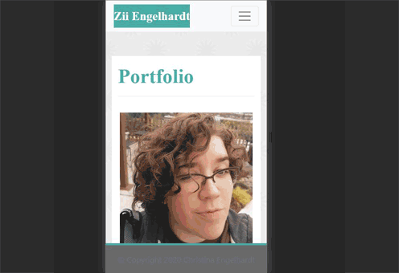
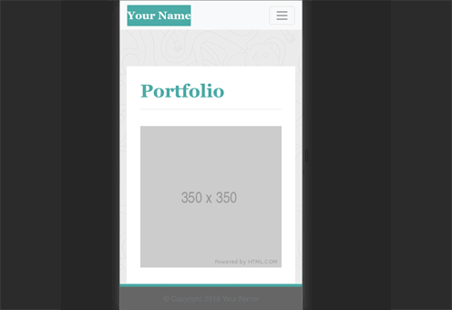

(This branch is to archive the original version of this assignment as submitted. It got better.)

# ResponsivePortfolio
Second Homework assignment for uw-sea-fsf-pt-08-2020-u-c, looking to build [a mobile-first, responsive portfolio based on screenshots provided.][1].

## Table of Contents

* [Description](#description)
  * [The Starting Point](#the-starting-point)
  * [Challenges and Adaptations](#challenges-and-adaptations)
  * [Built With](#built-with)
* [Contact](#contact)

## Description 
For this assignment, we were provided with screenshots of a 3-page portfolio and how it should be rendered at each of 3 screen widths: 400px, 768 px, and 992 px. From these images, we were asked to replicate the design and create our own About, Contact, and Portfolio pages with the same color scheme and fonts.

### The Starting Point
The 9 images provided for the assignment showed how the design should respond to different screen widths. 

Without being given the background image used in the template, we were tasked with finding or making one that fit the same colors. Using Photoshop, I pulled the RGB values for all the colors used in the templates and created a simple background. Through trial and error, I found the columns used to make the content for each resolution flow correctly.

### Challenges and Adaptations
The hardest part was getting a footer that would stick to the bottom of the window but still keep space between the white content area and the start of the footer. To force that transition, I added in an empty &lt;div&gt; that had Bootstrap's "my-" class to create enough space to bridge the gap.

For the most part, the challenge of this activity was finding the right customizations to use for the proportions to work correctly. Bootstrap is a very easy system to design in, but it's also easy to over-design. I struggled to get the navbar elements to be on the right side of the screen - until I noticed the template I copied over had the class to _center_ them already inside. Once the extra piece had been removed, it snapped right into place.

Overall, this was a great opportunity to learn what it's possible to make with Bootstrap and quickly get a visually interesting website off the ground from a basic idea.

### Built With

* Bootstrap elements from [getbootstrap.com](https://getbootstrap.com/)
* jQuery links, as requested by Bootstrap's installation instructions.

## Contact

Zii (Christina) Engelhardt - cjengelhardt@gmail.com

Project Link: [https://ziieng.github.io/ResponsivePortfolio/](https://ziieng.github.io/ResponsivePortfolio/)

Repository Link: [https://github.com/ziieng/ResponsivePortfolio](https://github.com/ziieng/ResponsivePortfolio)

[1]:<https://ziieng.github.io/ResponsivePortfolio/>
