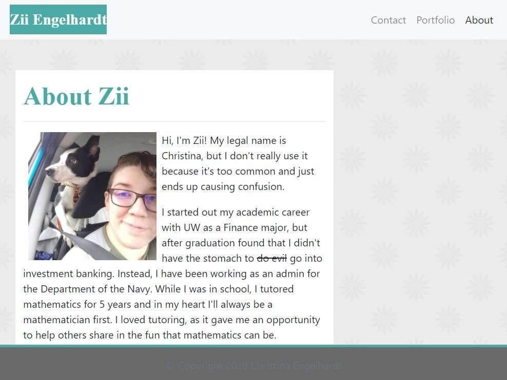
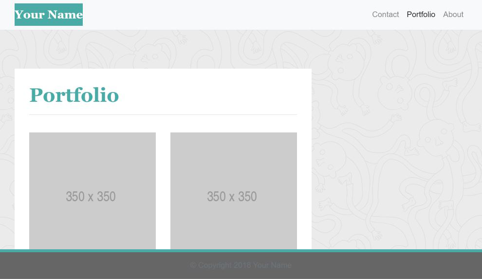

# ResponsivePortfolio
Second Homework assignment for uw-sea-fsf-pt-08-2020-u-c, looking to build [a mobile-first, responsive portfolio based on screenshots provided.][1].

## Table of Contents

* [Description](#description)
  * [The Starting Point](#the-starting-point)
  * [Challenges and Adaptations](#challenges-and-adaptations)
  * [Built With](#built-with)
* [Contact](#contact)

## Description 
For this assignment, we were provided with screenshots of a 3-page portfolio and how it should be rendered at each of 3 screen widths: 400px, 768 px, and 992 px. From these images, we were asked to replicate the design and create our own About, Contact, and Portfolio pages with the same color scheme and fonts.

### The Starting Point
The 9 images provided for the assignment showed how the design should respond to different screen widths. 

### Challenges and Adaptations

### Built With

* Bootstrap elements from [https://getbootstrap.com/] (https://getbootstrap.com/)
* jQuery links, as requested by Bootstrap's installation instructions.

## Contact

Zii (Christina) Engelhardt - [@zaranai](https://twitter.com/zaranai) - cjengelhardt@gmail.com

Project Link: [https://ziieng.github.io/ResponsivePortfolio/](https://ziieng.github.io/ResponsivePortfolio/)

Repository Link: [https://github.com/ziieng/ResponsivePortfolio](https://github.com/ziieng/ResponsivePortfolio)

[1]:<https://ziieng.github.io/ResponsivePortfolio/>